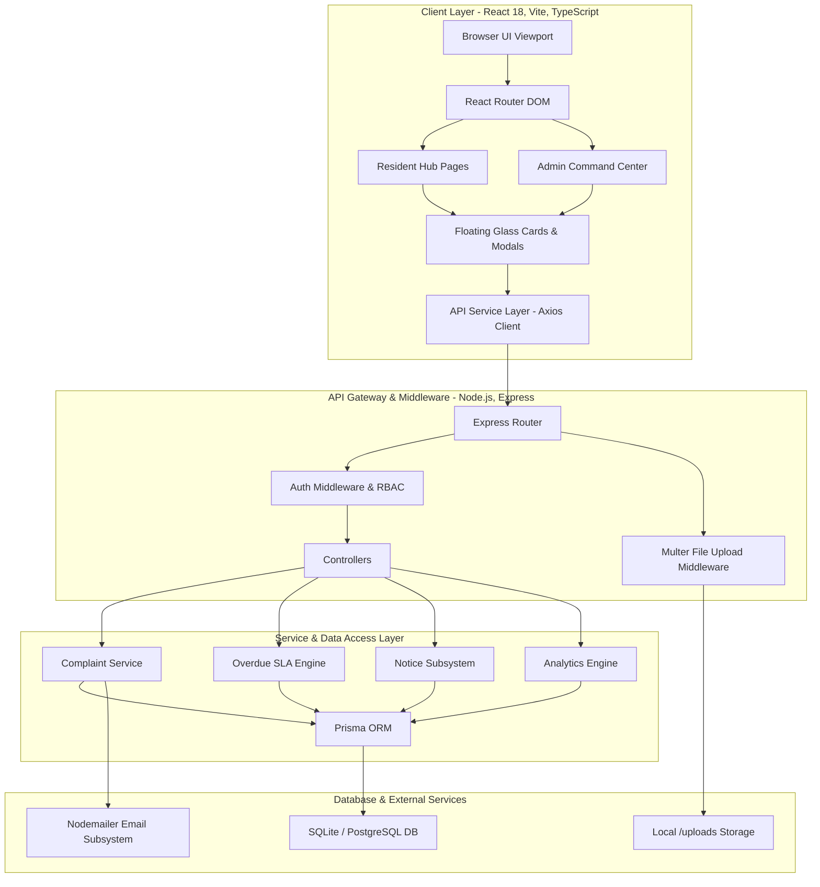

# NestGrid

> **Smart Residential Management Network**

NestGrid is an enterprise-grade, full-stack maintenance management platform designed for modern apartment communities, residential societies, and facility managers. It streamlines maintenance complaint tracking, resolution auditability, community notice broadcasting, and operational SLA analytics within a cinematic architectural interface.

- **Live Hosted Application**: [https://society-maintenance-tracker-sooty-theta.vercel.app/](https://society-maintenance-tracker-sooty-theta.vercel.app/)
- **GitHub Repository**: [https://github.com/ayush-srivastava1257/Society-Maintenance-Tracker](https://github.com/ayush-srivastava1257/Society-Maintenance-Tracker)

---

## 🌐 Live Application & Demo Access

- **Live Web Application URL**: [https://society-maintenance-tracker-sooty-theta.vercel.app/](https://society-maintenance-tracker-sooty-theta.vercel.app/)

### 🔑 1-Click Demo Credentials
- **Admin Portal**: `admin@societyos.app` / `Admin@123` *(or click **Demo Admin** on login screen)*
- **Resident Portal**: `ananya@societyos.app` / `Resident@123` *(or click **Demo Resident** on login screen)*

---

## Architecture Overview & System Diagram

NestGrid follows a decoupled client-server architecture. The frontend is built as a single-page application using React 18, TypeScript, and Vite, while the backend is an Express REST API powered by Node.js, Prisma ORM, and SQLite (production-ready for PostgreSQL).



---

## Detailed Features Breakdown

### Resident Hub
- **Account Registration & Authentication**: Role-based access control (RBAC) with apartment/unit assignment and instant demo credential pre-fill.
- **Raise Maintenance Complaints**: Category selection (Plumbing, Electrical, Cleaning, Maintenance, Security, Other), detailed description, priority setting (Low, Medium, High), and photo evidence upload.
- **Signature 4-Stage Stepper**: Track complaint lifecycle progress through high-contrast glass pills:
  `1. Submitted -> 2. Admin Reviewed -> 3. Work In Progress -> 4. Fully Resolved`
- **Immutable Visual Audit Timeline**: Detailed history stepper displaying exact timestamps, status transitions, technician action notes, and actor signatures.
- **Community Notice Board**: Access official announcements with pinned important circulars anchored at the top.
- **Email Alerts**: Asynchronous email notifications dispatched when complaint status changes or when important community notices are published.

### Admin Command Center
- **Executive Facility Dashboard**: Key metric cards tracking Total, Open, In Progress, Resolved, and Overdue complaint counts.
- **Overdue SLA Attention Queue**: Prominently surfaces complaints exceeding the configurable SLA resolution threshold.
- **Recharts Visualizations & Donut Center Metrics**: Category pie chart featuring slice separation borders and total issue center counter; priority breakdown bar chart with count labels placed on top of bars.
- **Facility AI Maintenance Insights Engine**: Real-time database intelligence detecting recurring complaint clusters by apartment block, category trends, and resolution velocity.
- **Data-Dense Complaint Management Table**: Comprehensive sorting, searching, multi-select filtering (Category, Status, Priority, Overdue), and status update modals.
- **Notice Board Management**: Create, edit, delete, and pin important announcements to broadcast alerts to residents.
- **Configurable SLA Thresholds**: Adjust overdue resolution days (default 3 days) dynamically via system preferences.

---

## Tech Stack & Dependencies

| Component | Technology | Version | Description |
| :--- | :--- | :--- | :--- |
| **Frontend Framework** | React | 18.2.0 | UI rendering & component architecture |
| **Build Tool** | Vite | 5.1.6 | Fast ESM module bundler |
| **Language** | TypeScript | 5.3.3 | Type safety across client & server |
| **Styling** | Tailwind CSS | 3.4.1 | Architectural dark glass design system |
| **Icons** | Lucide React | 0.344.0 | Clean vector iconography |
| **Charts** | Recharts | 2.12.2 | Data analytics visualizations |
| **Backend Runtime** | Node.js & Express | 4.18.3 | Lightweight, fast REST API framework |
| **Database ORM** | Prisma | 5.10.2 | Type-safe database client & migrations |
| **Database** | SQLite | 3.x | Zero-config SQL engine (PostgreSQL compatible) |
| **Security** | JWT & Bcrypt | 9.0.2 / 2.4.3 | Bearer authentication & password hashing |
| **File Storage** | Multer | 1.4.5 | Multipart form-data photo handling |
| **Testing** | Jest & Supertest | 29.7.0 | Backend integration test suite |

---

## REST API Reference

### Authentication Routes (`/api/auth`)
- `POST /api/auth/register` — Register a new resident account.
- `POST /api/auth/login` — Authenticate credentials and receive JWT bearer token.
- `POST /api/auth/forgot-password` — Request password reset email.
- `GET /api/auth/me` — Retrieve current authenticated user profile.

### Complaint Routes (`/api/complaints`)
- `GET /api/complaints` — Retrieve complaints (supports filtering by status, category, priority, search, overdue).
- `GET /api/complaints/my` — Retrieve complaints reported by the logged-in resident.
- `GET /api/complaints/:id` — Retrieve single complaint details with complete audit history.
- `POST /api/complaints` — Create a new complaint (supports photo evidence upload).
- `PATCH /api/complaints/:id/status` — Transition complaint status and log audit note (Admin only).
- `PATCH /api/complaints/:id/priority` — Update complaint priority level (Admin only).

### Notice Routes (`/api/notices`)
- `GET /api/notices` — Retrieve all community notices.
- `POST /api/notices` — Create a new notice (Admin only).
- `PUT /api/notices/:id` — Update an existing notice (Admin only).
- `DELETE /api/notices/:id` — Delete a notice (Admin only).

### Dashboard & Settings Routes
- `GET /api/dashboard/resident` — Retrieve resident portal metrics, recent complaints, and pinned notices.
- `GET /api/dashboard/admin` — Retrieve admin command center metrics, overdue queue, insights, and charts.
- `GET /api/settings` — Retrieve system configuration preferences.
- `PUT /api/settings` — Update SLA overdue threshold days (Admin only).

---

## Project Structure

```
Society Maintenance Tracker/
├── client/                     # React 18 + Vite + TypeScript Frontend
│   ├── public/                 # Static assets (bg_image.jpg, favicon)
│   ├── src/
│   │   ├── components/         # Common buttons, badges, tables, modals, charts
│   │   ├── context/            # AuthContext & ToastContext providers
│   │   ├── pages/              # Auth, Resident Hub, and Admin Portal pages
│   │   ├── services/           # Axios API client wrapper
│   │   ├── types/              # TypeScript interface definitions
│   │   └── index.css           # Tailwind directives & glass-card utilities
│   ├── index.html              # Entry HTML document
│   └── vite.config.ts          # Vite configuration & API proxy
│
├── server/                     # Node.js + Express + TypeScript Backend
│   ├── prisma/                 # Database schema & seed scripts
│   ├── src/
│   │   ├── controllers/        # Request handlers (Auth, Complaint, Notice, Dashboard)
│   │   ├── middleware/         # Auth RBAC & Multer upload middleware
│   │   ├── routes/             # Express API routes
│   │   ├── services/           # Analytics, Email, and SLA Overdue logic
│   │   ├── utils/              # JWT & password hashing helpers
│   │   └── app.ts              # Express application setup
│   └── tests/                  # Jest & Supertest integration test suite
│
├── README.md                   # Enterprise product documentation
└── SYSTEM_DESIGN.md            # System architecture specification
```

---

## Local Development Setup

### 1. Prerequisites
- Node.js v18.0.0 or higher
- npm v9.0.0 or higher

### 2. Environment Configuration
Create `.env` inside `server/`:
```env
PORT=5000
JWT_SECRET=nestgrid_secret_key_2026
DATABASE_URL="file:./dev.db"
CLIENT_URL=http://localhost:3000
NODE_ENV=development
```

### 3. Execution Commands

#### **Terminal 1 — Start API Server**
```bash
cd server
npm install
npm run prisma:migrate
npm run seed
npm run dev
```

#### **Terminal 2 — Start Frontend Client**
```bash
cd client
npm install
npm run dev
```

Open **[http://localhost:3000](http://localhost:3000)** in your browser.

---

## Testing & Verification

Run backend integration test suite:
```bash
cd server
npm test
```

Run frontend production build verification:
```bash
cd client
npm run build
```

---

## License
NestGrid Smart Residential Management Network. Copyright (c) 2026. All rights reserved.
