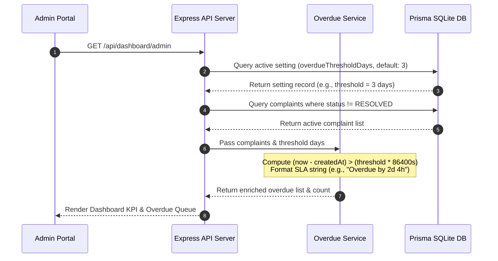

# NestGrid System Design Architecture

NestGrid is a full-stack maintenance management platform designed for modern apartment communities. This document details the key architectural decisions governing data integrity, auditability, SLA overdue tracking, media storage, notification pipelines, and glassmorphism UI design tokens.

---

## 1. Immutable Complaint Lifecycle & Audit History Model

A primary requirement of property management software is maintaining an absolute, unalterable trail of accountability for maintenance issues.

```
+-----------------------------------------------------------------------------------+
|                                  COMPLAINT TABLE                                  |
| id | residentId | title | category | status (OPEN -> IN_PROGRESS -> RESOLVED)     |
+-----------------------------------------------------------------------------------+
                                         |
                       Prisma Atomic DB Transaction
                                         v
+-----------------------------------------------------------------------------------+
|                             COMPLAINT_HISTORY TABLE                               |
| id | complaintId | oldStatus | newStatus | actorId | note | createdAt (Timestamp) |
+-----------------------------------------------------------------------------------+
```

### Key Architectural Decisions:
- **Separation of State vs. Audit Log**: The `Complaint` table records current state (`OPEN`, `IN_PROGRESS`, `RESOLVED`), priority, and resolution timestamp. Historical transitions are stored in an append-only `ComplaintHistory` ledger table.
- **Transactional Consistency**: Status transitions are executed inside Prisma database transactions (`prisma.$transaction`). Updating complaint status and inserting audit record occur atomically; if either fails, the operation rolls back cleanly.
- **Actor & Context Tracking**: Every history record links directly to the `actorId` (Admin or Resident), capturing technician action notes (e.g., *"Replacement valve ordered"*). History records cannot be modified or deleted via API endpoints.

---

## 2. Configurable Overdue & SLA Detection Engine

To avoid stale state bugs caused by hardcoded database flags, NestGrid implements **derived SLA calculation logic**.

```
Overdue Condition = (currentTime - createdAt > thresholdDays * 86400000) 
                    AND (status != 'RESOLVED')
```



### Key Architectural Decisions:
- **Zero Database Pollution**: Overdue status is computed dynamically at query time based on `createdAt` timestamps, current server time, and active `overdueThresholdDays` configuration in the `Setting` table.
- **Configurable Thresholds**: Administrators can dynamically modify resolution SLA thresholds (e.g., from 3 days to 2 days) via system preferences without database migration scripts.
- **Human-Readable Granularity**: The backend `OverdueService` formats precise SLA duration metrics (e.g., *"Overdue by 2 days 4 hours"* or *"Due in 8 hours"*).
- **Closed Complaints Exemption**: Once a complaint reaches `RESOLVED`, `resolvedAt` is set, permanently exempting it from overdue queues regardless of age.

---

## 3. Visual Theme & Glassmorphism Design Architecture

NestGrid incorporates a custom **Cinematic Dark Architectural Theme**:

```
+-----------------------------------------------------------------------------------+
| Viewport Shell (#050B14) + Background Photo (bg_image.jpg) + Blackish Tint Overlay  |
|                                                                                   |
|  +-----------------------------+  +--------------------------------------------+  |
|  | Fixed Glass Sidebar         |  | Floating Glass Cards (.glass-card)         |  |
|  | rgba(10,18,29,0.9)          |  | rgba(5,11,20,0.88) + 20px Backdrop Blur    |  |
|  | 20px Blur + Warm Orange Border|  | Warm Dusk Orange Accents (#E88D38)         |  |
|  +-----------------------------+  +--------------------------------------------+  |
+-----------------------------------------------------------------------------------+
```

### Design System Tokens:
- **Viewport Background**: `#050B14` (Deep Architectural Blackish Navy)
- **Glass Container**: `rgba(5, 11, 20, 0.88)` with `backdrop-filter: blur(20px)` and `border: 1px solid rgba(232, 141, 56, 0.3)`
- **Primary Accent**: `#E88D38` (Warm Dusk Orange) with hover `#F09B48`
- **Serif Typography**: Cormorant Garamond & Playfair Display (`#E9E3D2`)
- **Muted Subtext**: `#A7B1B5` / `#D8D1BF`

---

## 4. Photo Evidence & File Upload Pipeline

Residents can optionally upload photo evidence to document maintenance defects.

```
Resident Client (Dropzone / Preview) 
  --> Multipart Form Data Upload 
  --> Multer Middleware (Validation: Type & 5MB Limit) 
  --> Local /uploads Storage 
  --> Path Reference in Complaint DB
```

---

## 5. Non-Blocking Email Alert Subsystem

When complaint status updates occur or important community notices are published, NestGrid triggers email alerts asynchronously.

- **Dev Console Logger Fallback**: In development, email payloads are logged with formatted ASCII frames.
- **Production SMTP Transport**: Configurable for SendGrid, AWS SES, or custom SMTP servers.
